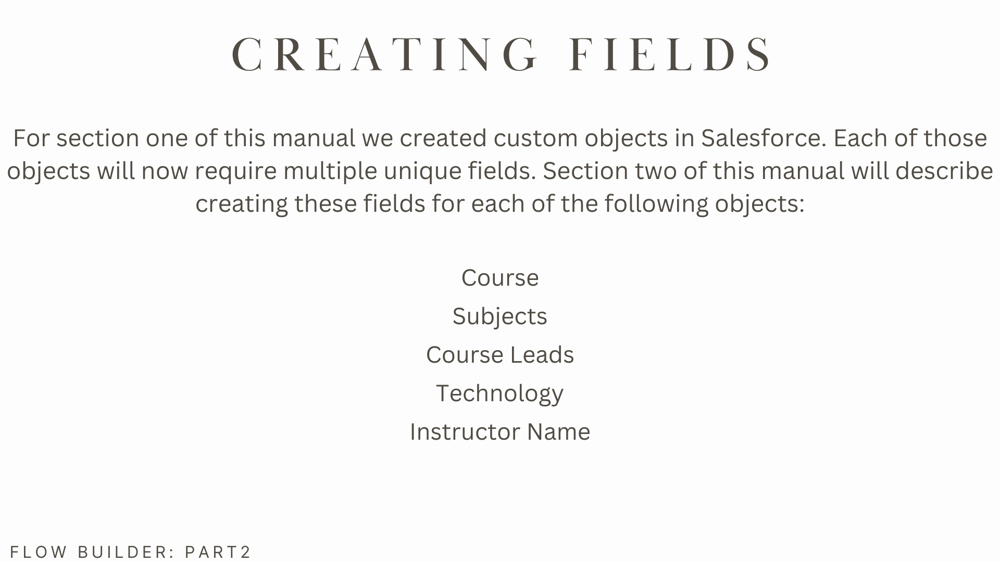
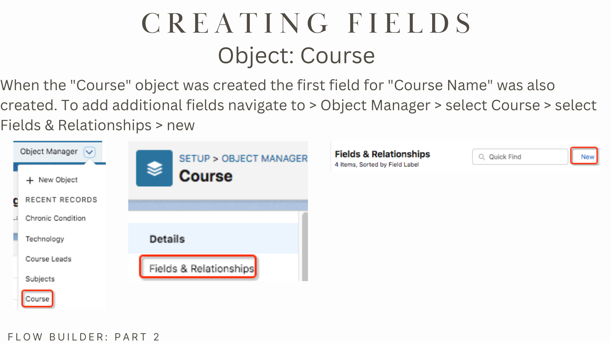
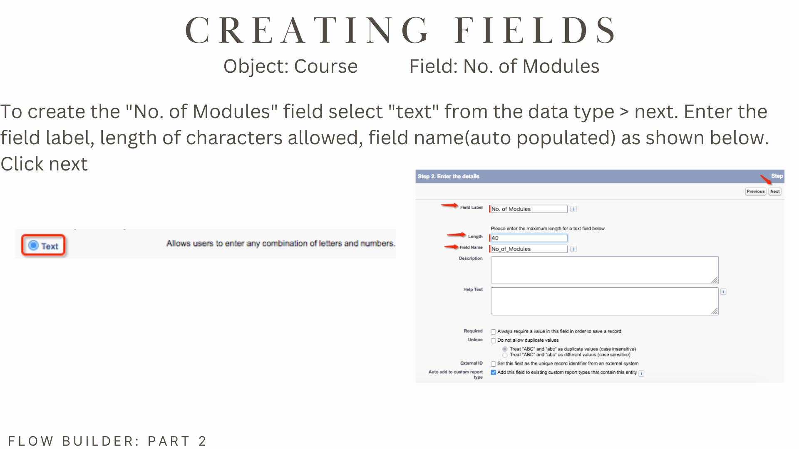
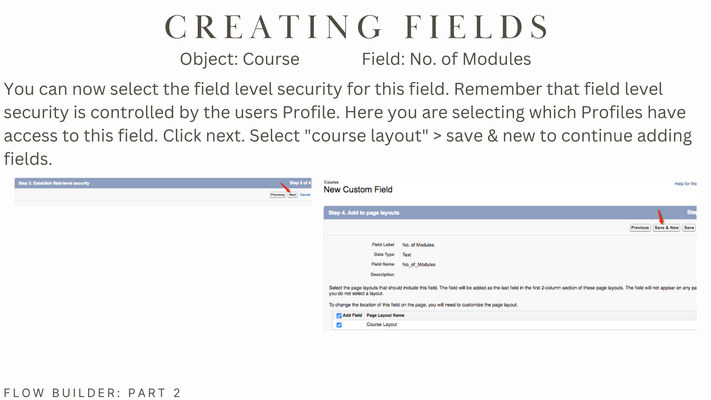
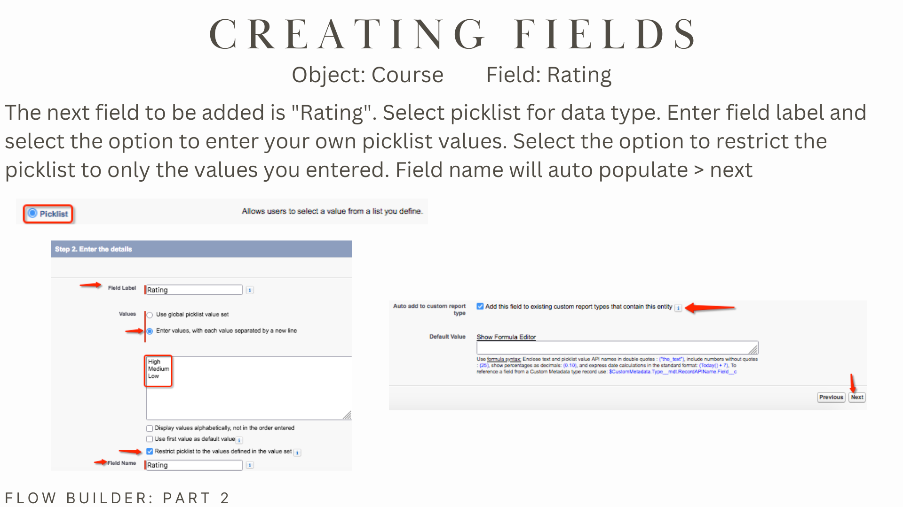
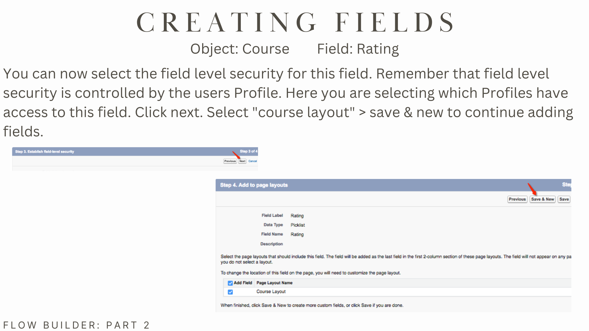
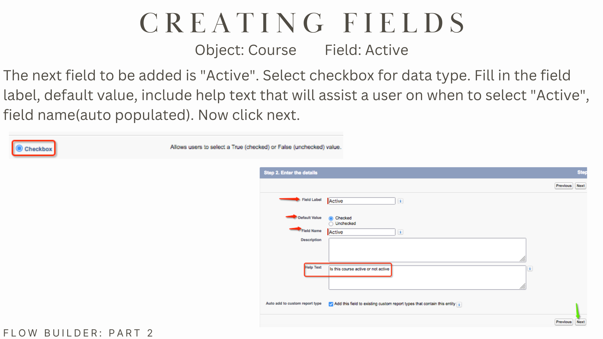

# Introducing Salesforce Flow
> **_NOTE:_**  The following slides are highlights from a deck of 90 total slides.

Salesforce introduced Flow as the newest tool for automating business processes, enabling organizations to streamline workflows, reduce manual effort, and enhance data accuracy. I led the development of a training deck designed to help our team understand and implement Salesforce Flow. This presentation outlines:

<li>Creating custom objects</li>
<li>Creating custom fields</li>
<li>Creating Workflows</li>
<li>Configuring validation rules</li>
<li>Utilizing Flow Builder</li>

 

 

